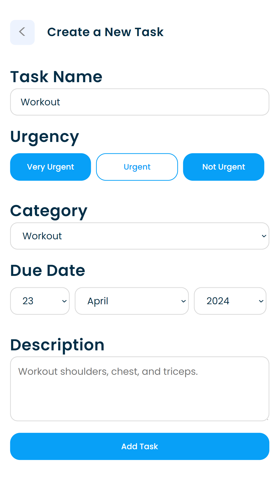

<h3 align="center">Task Manager</h3>

  

    Maximize your productivity with this task manager!
     
  

<!-- TABLE OF CONTENTS -->

  
Table of Contents

  <ol>
    <li>
      <a href="#about-the-project">About The Project</a>
      <ul>
        <li><a href="#inspiration-behind-the-project">Inspiration Behind The Project</a></li>
        <li><a href="#features">Features</a></li>
        <li><a href="#built-with">Built With</a></li>
      </ul>
    </li>
    <li><a href="#website-demo">Website Demo</a></li>
    <li><a href="#acknowledgments">Acknowledgments</a></li>
  </ol>

<!-- ABOUT THE PROJECT -->
## About The Project

### Inspiration Behind The Project

Welcome to my first full-stack web app! In the chaos of everyday tasks, staying productive can feel like a nightmare. Out of that struggle, this project emerged as a solution to maintain productivity and motivation at its peak.

### Features

- Easily create, edit, and delete tasks to keep your to-do list organized.
- Designed to work seamlessly on mobile devices.
- Set your goals and earn rewards upon completing tasks, providing motivation to stay productive.
- Assign priority levels and due dates to task to be prepared for the upcoming deadlines.
 

### Built With

[![React][React.com]][React-url]
[![Express.js][Express.com]][Express-url]
[![CSS][CSS.com]][CSS-url]
[![Javascript][Javascript.com]][Javascript-url]
[![HTML][HTML.com]][HTML-url]

<!-- USAGE EXAMPLES -->
## Website Demo

    
    
    
    
    

<!-- ACKNOWLEDGMENTS -->
## Acknowledgments

* [README Template](https://github.com/othneildrew/Best-README-Template)

 

<!-- MARKDOWN LINKS & IMAGES -->
<!-- https://www.markdownguide.org/basic-syntax/#reference-style-links -->
[React.com]: https://shields.io/badge/react-black?logo=react&style=for-the-badge
[React-url]: https://react.dev/

[Express.com]: https://img.shields.io/badge/express.js-%23404d59.svg?style=for-the-badge&logo=express&logoColor=%2361DAFB
[Express-url]: https://expressjs.com/

[HTML.com]: https://img.shields.io/badge/HTML-239120?style=for-the-badge&logo=html5&logoColor=white
[HTML-url]: https://developer.mozilla.org/en-US/docs/Web/HTML

[CSS.com]: https://img.shields.io/badge/CSS-239120?&style=for-the-badge&logo=css3&logoColor=white
[CSS-url]: https://developer.mozilla.org/en-US/docs/Web/CSS

[Javascript.com]: https://img.shields.io/badge/JavaScript-F7DF1E?style=for-the-badge&logo=javascript&logoColor=black
[Javascript-url]: https://www.javascript.com/